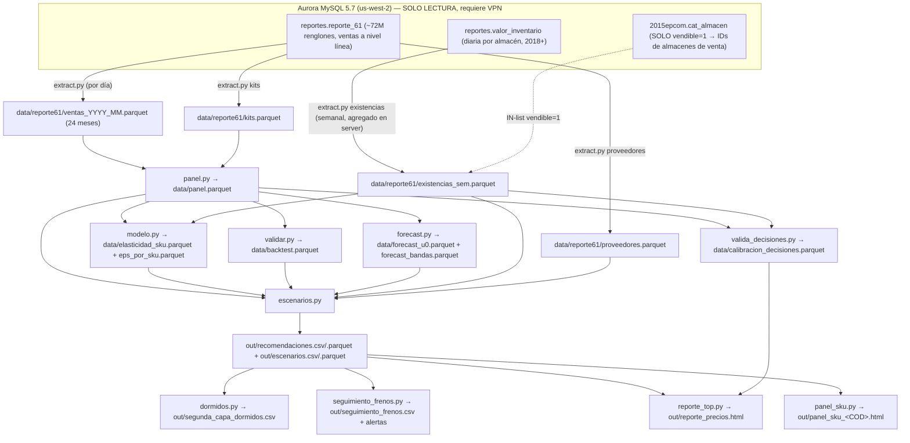

# ARQUITECTURA DEL MOTOR DE PRECIO ÓPTIMO v3 — fuente única de verdad

> Documento autoritativo derivado del CÓDIGO real del repo (2026-07-27).
> Cada afirmación cita el archivo/función de origen. Si algo no está aquí,
> verificar contra el código antes de asumirlo. Complementa (no sustituye)
> `CLAUDE.md` y el memory `v3-fuente-datos.md`.

---

## 1. MAPA DE ARCHIVOS

Orden canónico del pipeline (`run.py`, lista `PASOS`):
`panel.py → modelo.py → validar.py → forecast.py → escenarios.py`.
La extracción NO está en `run.py` (es lenta; se corre aparte con VPN).

| Archivo | Qué hace | Consume | Produce |
|---|---|---|---|
| `db.py` | Conexión Aurora MySQL (pymysql). `query()` solo acepta SELECT/SHOW/DESCRIBE/DESC/EXPLAIN/WITH (`_VERBOS_LECTURA`). Escritura DORMIDA acotada a `precio_optimo_*` (`_validar_tabla_propia`). `guardar_recos_local()` escribe out/ | `.env.local` | `out/{nombre}.csv` y `.parquet` |
| `extract.py` (default) | Ventas facturadas de `reportes.reporte_61` por DÍA (estatus='Activa', precio>0, cantidad>0), 17 columnas (`COLS`), reintentos VPN (`REINTENTOS=4`) | Aurora (VPN) | `data/reporte61/ventas_YYYY_MM.parquet` |
| `extract.py existencias` | Snapshot SEMANAL (lunes; fallback mar/mié) de `reportes.valor_inventario` agregado en servidor: existencia_total, existencia sin apartada, disp. en almacenes de venta (`vendible=1` en `2015epcom.cat_almacen`), p1/p3, MAX(cantidad_bo). Resume + checkpoint cada 10 semanas (`extraer_existencias`) | Aurora (VPN) | `data/reporte61/existencias_sem.parquet` |
| `extract.py kits` | Censo de códigos con `kit='Si'` en el rango (`extraer_kits`) | Aurora (VPN) | `data/reporte61/kits.parquet` |
| `extract.py proveedores [dias]` | Censo codigo→proveedor MODAL de últimos N días (default 45) (`extraer_proveedores`) | Aurora (VPN) | `data/reporte61/proveedores.parquet` |
| `panel.py` | Limpieza (servicio/kits/promo/tipo_precio∈{1,3}), dedup exactos, identidad de descuentos, asserts de moneda, agregado SKU×semana con semanas completas (≥6 días), precio del tipo MODAL, `unidades_rec` sin proyectos, flag `activo` (≥`MIN_SEMANAS=8`) | `data/reporte61/ventas_*.parquet`, `kits.parquet` | `data/panel.parquet` |
| `modelo.py` | ε por PPML (`pyfixest.fepois`) con ceros interiores y filtro de stockouts (`con_ceros`); global + 3 segmentos de rotación + ESCALERA POR PROVEEDOR con blend EB inverso-varianza (`elasticidad`, `MIN_SKU_PROV=30`); tendencia log-lineal (`tendencia`) | `data/panel.parquet`, `existencias_sem.parquet` | `data/elasticidad_sku.parquet` (ε global), `data/eps_por_sku.parquet` (ε por segmento) |
| `validar.py` | Backtest OOT del u0 por COMPETENCIA (última sem / media 4/8/12) en holdout `H=3` semanas + bandas empíricas p10/p50/p90 del ratio real/pred por tercil (`correr_backtest`) | `data/panel.parquet` | `data/backtest.parquet` |
| `forecast.py` (default) | u0 oficial: GBM residual (HistGradientBoosting aprende factor sobre media_4s, clip [0,5]) + bandas propias en 4 ventanas rodantes (`generar_u0`). **T2.1 (2026-07-27): duelo por CLASE DE SERIE** — SBA (Croston corregido, `_sba_fila`) compite contra el GBM en cada ventana OOT con RMSSE; sustituye solo si gana ≥3/4 (regla FVA). Resultado vigente: SBA en errática (4/4) y grumosa/lumpy (3/4) = 8,525 SKUs; GBM en suave (1/4) e intermitente (2/4). Columna `metodo` en forecast_u0.parquet. Modo `competencia`: carrera vs media_4s + robustez + híbridos (`correr`, `robustez`, `hibrido`) | `data/panel.parquet` | `data/forecast_u0.parquet`, `data/forecast_bandas.parquet` |
| `escenarios.py` | Recomendación por SKU con guardrails, señales, roles KVI, meses de stock, rejilla ±1,2,3,4,6,8,10% — pasos enteros, ±3 incluido (`recomendar`, ver §4). Si existe `data/aws_forecast/`, anexa columnas INFORMATIVAS `aws_u_prox_mes`/`aws_tendencia_pct`/`aws_vs_u0_pct`/`aws_wape_pct` (segunda opinión; no decide). REGLA (usuario 2026-07-27): del forecast AWS solo se usan meses ESTRICTAMENTE FUTUROS (`mes > mes_actual`) — el mes en curso ya se conoce y se descarta ("agosto sí, julio no"). También anexa AMPLITUD TERRITORIAL (`aws_suc_activas`/`aws_suc_alza_frac`/`aws_suc_top_share` desde el detalle por sucursal, 25 sucursales): demanda ancha vs concentrada — misma lógica que "proyecto no es demanda". REGLA (usuario 2026-07-27): el precio es NACIONAL (no hay precios por región); la geografía NO decide, pero se MENCIONA en la explicación de SUBIR/BAJAR (🗺️ ANCHA si alza en ≥50% de ≥3 sucursales activas; 📍 CONCENTRADA si top sucursal ≥60%) y como badge en el reporte | panel, elasticidad, eps_por_sku, backtest, forecast_u0/bandas, existencias_sem, proveedores, aws_forecast (opcional) | `out/recomendaciones.{csv,parquet}`, `out/escenarios.{csv,parquet}` |
| `valida_decisiones.py` | Calibración empírica: replay de cambios reales de lista ≥1.5% vs contrafactual de mercado, éxito por dirección×magnitud (`correr`) — corre aparte. **T2.3 (2026-07-27) BLINDAJE**: (a) CONTROLES LIMPIOS — el factor de mercado excluye celdas SKU-semana con cambio de precio reciente ±3 sem (22% excluido; espíritu Callaway–Sant'Anna); (b) filtro de PRE-TENDENCIAS anti regresión-a-la-media — si la demanda propia divergió ±30% vs mercado ANTES del cambio, el evento se excluye (re-corrida 2026-07-31 con ventana 2024→hoy: 21,013 excluidos ⇒ 11,567 eventos limpios). Calibración vigente: subidas 2-3% ganan 58% de 3,515 (+11.7% portafolio); 4-5% ganan 58% de 761; bajadas >9% pierden 74% (−26.6%) | panel, existencias_sem | `data/calibracion_decisiones.parquet` |
| `dormidos.py` | SEGUNDA CAPA: diagnostica activos históricos SIN evaluación del motor (dormidos = `set(u.index) − set(recos.codigo)` en `correr()`) y emite DIRECCIÓN: REACTIVAR (quedó caro → volver DIRECTO al precio de su época viva; sin paso gradual porque un muerto no tiene clientes que perturbar), LIQUIDAR, EVALUAR CONTINUIDAD, COMPRAS; incluye `explicacion` de estatus por SKU — corre aparte | panel, `out/recomendaciones.csv`, existencias_sem, proveedores.parquet | `out/segunda_capa_dormidos.csv` (con direccion/precio_sugerido/explicacion) |
| `seguimiento_frenos.py` | Seguimiento DIARIO de frenos por reabasto. `registrar`: alta desde recos con señal "frenar". Default (`revisar`): BD viva (VPN) o snapshot local; al recuperar cobertura ≥`UMBRAL_OK=6` sem → BAJAR/REVERTIR/MANTENER; alerta macOS + `ALERTA_frenos_*.txt` solo con datos vivos. Cron instalado: `30 8 * * 1-5` (marca `# motor-precios-seguimiento-frenos`). **T2 PASS-THROUGH POR EVENTO (aprobado 2026-07-27 'lo aprobamos así')**: `revisar_costos()` corre en el mismo cron — si costo_prov subió ≥2% desde la emisión del ciclo Y el precio actual ya no sostiene el piso (+3pts sobre neto, escalando el costo de venta por el ratio de reposición), alerta con LISTA MÍNIMA DEFENSIVA (`out/ALERTA_costos_*.txt` + notificación). SOLO defiende el piso, no re-optimiza; excepción a la cadencia análoga a F1. Anti-duplicados por nivel de costo en `out/defensa_margen.csv`; sin VPN no alerta | recos, Aurora (opcional), existencias_sem, panel | `out/seguimiento_frenos.csv`, `out/ALERTA_frenos_YYYY-MM-DD.txt` |
| `panel_sku.py <COD>` | Vista HTML de detalle de UN SKU (`generar`); exporta bloques reutilizables (`cargar_ctx`, `cuerpo_sku`, `ESTILOS`, `JS_LIB`) | panel, recos, escenarios, eps, seguimiento_frenos.csv | `out/panel_sku_<COD>.html` |
| `reporte_top.py [N] [TOP]` | Reporte HTML con 3 vistas. **REGLA DE DISEÑO (usuario 2026-07-30): el RESUMEN es para barrido visual en una vista — etiquetas cortas SIEMPRE con su dato (nivel/%/meses) + semáforo de color; toda explicación en prosa vive en el flotante (title) de cada chip/celda y, completa, en el panel DETALLADO.** Etiquetas compactas: motivo → `motCorto()` (SOBRESTOCK Nm / REVERTIR ALZA / PROTEGER KVI / VENDE CARO / FRENO / MEDICIÓN — cubre los ~450 textos del motor), demanda `▲ +7%/mes`, territorio `📍 84% · 1 SUC.` / `🗺️ 13/25 SUC.`, web `👁 WEB 0.5%` / `🛒 WEB 21%`, serie `⚡ IRREGULAR`/`ESPORÁDICA`, `🎲 CONTROL`, `🧪 MEDICIÓN`; confiabilidad `±err% · ALTA/MEDIA/BAJA`; impacto SUBIR `+$X/sem · peor: +$Y`. (1) MOTOR: todos los evaluables con filtros (dirección/rol/proveedor multiselect con búsqueda/confianza/código), paneles embebidos top-N por dirección (default 30) + top-TOP global (default 200), celda "Confiabilidad" **rediseñada (usuario 2026-07-30): muestra lo que VARÍA por producto** — margen de error del pronóstico propio (rango p10-p90 vs esperado, tope de display ±999%; mediana del catálogo ±100%) + nivel de confianza (color: alta=verde/media=ámbar/baja=rojo); la tasa base de la calibración empírica (dirección × cubeta de paso, p.ej. "58% de 632 subidas ~4%") es un hecho GLOBAL que se repetía en el 95% de las filas (guardrail ⇒ casi todo paso=4%) ⇒ se movió al encabezado (subtítulo de las tarjetas Subir/Bajar) y al tooltip de la celda; (2) DORMIDOS 2ª capa — ENFOQUE (usuario 2026-07-27): la vista solo muestra dormidos con >8 semanas sin venta Y stock vendible >0 (lo accionable por precio; 1,641 de 3,664 en la corrida vigente — el resto vive en el CSV completo); columna `meses_stock_era` = stock vendible ÷ venta de su ÉPOCA VIVA mensualizada (contra la venta actual sería infinito) visible en la celda de stock y en el factor 3 del detallado; los TOP 100 por capital atrapado tienen DETALLADO embebido (`panel_sku.cuerpo_dormido`, 2026-07-27): diseño propio centrado en el PORQUÉ (factores numerados con cifras: dejó de vender hace N sem → sí tenía vida → capital atrapado → factor decisivo según diagnóstico + 🧪 laboratorio), 'Qué hacer' en lenguaje de negocio, historia completa con proyección en 0 y película de costos; (3) **SIMULADOR DE ESCENARIOS (2026-07-27)**: what-if de ±n% sobre todo el catálogo / proveedor(es) / lista de códigos, con la MISMA matemática del motor (u=u0·f^ε por SKU con ε de la escalera, π=u·(neto·f−costo), IC95 con ε±1.96se sumado por extremos = conservador); neto0/costo derivados de utilidad y margen auditados (neto0=(π0/u0)/margen); muestra Δ unidades/ingreso/utilidad sem y mes, avisos de guardrail (±4%/ciclo ⇒ K ciclos), piso de margen, KVIs y sobrestock, contexto AWS del próximo mes, y top-20 impactados. EXPLORATORIO: no aplica políticas — el motor sí (`generar`) | salidas del pipeline + calibracion_decisiones | `out/reporte_precios.html` |
| `aws_forecast.py [pred.csv] [cat.csv]` | Integra el forecast MENSUAL del proceso AWS del negocio (2026-07-27): normaliza (`office_branch='all'`, item_id→codigo vía cat_modelos, demanda negativa→0), CALIFICA su precisión en meses con fact+prediction (WAPE global 36%, apenas gana al ingenuo mes-anterior 37%; WAPE por SKU mediana 64%) y cruza vs u0 del motor (misma escala, mediana 1.04). **SEGUNDA OPINIÓN INFORMATIVA: no participa en el árbol de decisión** (uso en reglas pendiente de aprobación) — corre aparte, cuando llega export nuevo. Hechos del pipeline AWS (doc Confluence SOW4, leído 2026-07-27): predicciones = cuantil **P60** (sesgo alto deliberado; explica el +4-5% vs u0); outliers >μ+3σ reemplazados con KNN antes de entrenar (⇒ apunta a demanda RECURRENTE, compatible con nuestra exclusión de proyectos); flujo MENSUAL (EventBridge→StepFunctions→Batch, repo syscom_clearscale, contacto irving.canales@syscom.mx); inactividad ≥20 fechas ⇒ sin predicción; cold start por metadata brand/category. CAVEAT: predictions de meses pasados en el export son backtest in-sample ⇒ WAPE 36% es optimista; el examen honesto = archivar el forecast de cada mes y calificarlo al cierre | CSVs de AWS (Downloads), `out/recomendaciones.csv` | `data/aws_forecast/forecast_mensual.parquet`, `data/aws_forecast/wape_por_sku.parquet` |
| `ciclo.py [emitir\|cerrar]` | **T1.2 (aprobado 2026-07-27)**: loop proyección→realidad por ciclo. `emitir` congela snapshot INMUTABLE de recomendaciones (proyección, bandas, confianza, clase de serie, flags aplicado/holdout) en out/ciclos/; `cerrar` (+3 sem de datos) mide WAPE del ciclo y cobertura p10–p90 por clase de serie (SKUs sin cambio) y Δ real-vs-esperado contra control (SKUs aplicados, al salir de pruebas) con ajuste de mercado — corre aparte, uno por ciclo | recomendaciones.csv, panel | `out/ciclos/ciclo_*.csv`, `out/ciclos/cierre_*.csv` |
| `intermitentes.py` | T2.1: carrera Croston/SBA/TSB vs media (RMSSE por clase; base del duelo de forecast.py) | panel, adi_cv2 | `data/carrera_intermitentes.parquet` |
| `cuantiles.py` | T2.2: examen de bandas condicionales (GBM cuantil) vs tercil — juez: cobertura 80% por clase | panel, forecast_* | `data/examen_cuantiles.parquet` |
| `chronos_examen.py [small\|base]` | T2.5: Chronos-Bolt zero-shot vs u0 vigente (RMSSE por clase). Veredicto 2026-07-27: NO entra (vigente gana en errática/lumpy/intermitente; empate en suave) — queda como vara FVA periódica | panel, adi_cv2 | `data/examen_chronos.parquet` |
| `dml.py` | T2.7: Double ML (PLR Robinson, cross-fitting 5 folds por SKU, Mundlak≈FE, rezagos de demanda como confusores) — TERCER estimador de ε para triangulación | panel, eps_por_sku | `data/dml_eps.parquet` |
| `monitoreo.py [aceptar CODIGO...\|aceptar --ciclo\|revisar\|diagnostico]` | **MONITOREO DE DECISIONES APLICADAS con TRES HORIZONTES (2026-07-28, tras revisión externa)**: `aceptar` congela la proyección; `revisar` (cron diario) llena checkpoints semanales sem1..sem12 y emite VEREDICTO (ÉXITO/NEUTRO/FRACASO vs contrafactual de mantener, ±2% banda neutra, ajuste de mercado) a **4 sem (preliminar), 8 (adaptación/sustitución) y 12 (definitivo)** + error_proy por horizonte + en_banda_4. **CENSURA**: si el SKU recibe otro cambio a mitad de la medición (nueva aceptación o lista vigente ≠ precio aplicado ±1%) los horizontes no cerrados quedan CENSURADOS — jamás se finge medición limpia. `diagnostico` = índice de éxito por horizonte×dirección + censuras | recomendaciones.csv, Aurora (viva), panel | `out/monitoreo_cambios.csv`, `out/diagnostico_motor.csv` |
| `api_bi.py [token\|probar\|tablas\|muestra\|vigilar]` | Cliente de la API de BI (developers.syscom.mx, OAuth 365d, endpoints /api/v1/bi/*) — SOLO LECTURA con candados propios (SELECT/WITH, 1 sentencia, LIMIT, 429/307 manejados). Hoy: `v_bi_eventos_interacciones` (embudo web por producto desde 2026-07-23; mapea a codigo vía cat_modelos). `vigilar` corre en el cron diario: notifica cuando IT habilite tablas nuevas. **2026-07-30: reporte_61 y valor_inventario HABILITADAS (Redshift — TODO VARCHAR: castear; no mezclar MySQL/Redshift). VALIDACIÓN APROBADA: columnas completas en ambas (19/19 y 10/10 requeridas); inventario EXACTO al snapshot 2026-07-27 (39,393 SKUs, existencia idéntica al total y por código); ventas con filtros idénticos al extract cuadran +0.00% (al centavo) en abr/may/jun 2026 y ±0.06% en 24 meses; cobertura: ventas desde 2016-01-02 (72.5M renglones, 2 años MÁS que la ventana de Aurora que usamos) e inventario con ~3,070 snapshots diarios desde 2018-01-01 (vs 105 semanas locales). LECCIÓN (falso hueco de junio): el validador aplicaba tipo_precio IN (1,3) que el extract NO aplica — del 18 al 29 de junio ~10K renglones/día se registraron con tipo_precio=0 EN AMBAS BASES (evento real del negocio, ¿venta de aniversario?; un día normal trae ~10) ⇒ los filtros de una reconciliación deben ser IDÉNTICOS a los del extract, nunca los del panel. Luz verde para migrar consumidores por pasos.** **VALIDACIÓN ESPEJO EN VIVO (2026-07-31, Aurora-vivo vs Redshift-vivo, valida_espejo.py): VENTAS — 24 meses del pipeline +0.000% mes a mes; historia 2016-2023 (16 semanas de muestra día por día) +0.000%; 113 renglones al azar de 7 años con las 19 columnas idénticas en TODO lo numérico. INVENTARIO — 4 snapshots (2026-07-28, 2026-06-30, 2022-06-15, 2019-06-12): existencia/BO/costo USD +0.000%; conteo de SKUs −0.003/−0.005% en fechas viejas (1-2 códigos de 39K). Únicas divergencias, de TEXTO e inofensivas: (1) el ETL a Redshift pierde acentos ('línea'→'l?nea') — ninguna regla del pipeline filtra por caracteres acentuados (los filtros usan 'royecto' a propósito); reportar a IT; (2) NULL en Redshift vs cadena vacía en Aurora — normalizar al leer. REGLA DE MIGRACIÓN: al consumir de la API normalizar texto (NULL≈'', html.unescape) y nunca filtrar por caracteres acentuados. CONFIRMACIÓN COMPLETA: los datos de la API son los mismos de Aurora.** **VENTANA DE DATOS 2024→HOY (usuario 2026-07-31: "usemos datos desde el 2024 en ambos reportes")**: backfill ene-jul 2024 (3.04M renglones de ventas +0.000% espejo vs API en los 7 meses; 24 semanas de inventario — abr-may 2024 tiene ~5 lunes sin corte EN LA FUENTE, se omiten). Panel: 134 semanas / 12,873 SKUs evaluables (+279). ε por segmento recalibradas con más historia: bajo −0.76 / medio −0.87 / alto −1.00 (antes −0.83/−0.95/−1.05; consistente con |ε| como cota superior). Los tooltips comparativos de 3 niveles ahora son DINÁMICOS desde eps_por_sku (fix K2 de la auditoría) — jamás hardcodear ε en textos. | .env.local (BI_CLIENT_SECRET/BI_TOKEN) | `out/bi_allowlist.json`, `out/ALERTA_api_bi.txt` |
| `extract_api.py [existencias]` | **EXTRACTOR TITULAR (usuario 2026-07-31: "cambiemos las bases de datos a redshift y usemos aurora de backup")**: produce los MISMOS parquets que extract.py pero desde la API/Redshift (sin VPN) — ventas por día con paginación OFFSET (verificada sin solapes; se valida contra COUNT por día) y existencias semanales por agregado paginado; `disp_venta` usa el cache `data/cat_almacen_vendible.json` (cat_almacen solo vive en Aurora; refresco oportunista con VPN). **Fallback automático a Aurora por día/semana si la API falla**; extract.py queda como respaldo directo completo. **OPERATIVO desde 2026-07-31 — pruebas de fuego aprobadas: existencias (snapshot 07-27: 39,393 códigos, 8 columnas, cero diferencias reales; el único código discrepante era el mismo producto con U+200B invisible, ya normalizado) y ventas (día 07-29: 23,631 renglones por API, 100% espejo; los 7 renglones "de más" del parquet local resultaron facturas CANCELADAS después de la extracción — verificado contra Aurora en vivo).** Normalización de migración: NULL→'', jamás filtrar por caracteres acentuados (el ETL de IT los pierde: 'línea'→'l?nea') | api_bi, db (suplente), cat_almacen_vendible.json | los mismos de extract.py |
| `genera_paneles.py` | **CACHE NOCTURNO DE DETALLADOS (usuario 2026-07-31)**: genera el panel standalone de TODOS los modelos (motor + dormidos 2ª capa) en `out/paneles/panel_<COD>.html` + `index.html` con buscador — disponibles al instante en consulta, sin procesar nada. ~19 ms/panel ⇒ catálogo completo en ~4-5 min. Cron diario a las **0:00** (marca `# motor-precios-paneles-cache`): aunque el ciclo no corra, los bloques que cambian a diario (movimiento de costo de la vigía, frenos) amanecen frescos | recos, panel, escenarios, vigía, frenos | `out/paneles/*.html` |
| `forecast_mensual.py [backtest\|generar\|examen]` | **EXAMEN MENSUAL DE FORECASTS (usuario 2026-07-31: "3 comparativas e ir retroalimentando su error mes con mes")**: al cierre de cada mes califica contra la venta TOTAL real lo que cada fuente ARCHIVÓ — AWS, motor u0 (recurrente ×4.345, etiquetado), ingenuo (piso) y el RETADOR estacional propio (base 0.6·mes anterior+0.4·mediana 3m sin ceros-de-stockout × razón de índices estacionales) → marcador acumulado `out/examen_forecasts.csv`. **MÉTODO PROPIO ADOPTADO (2026-07-31, evaluación exhaustiva — ver docs/EVALUACION_FORECAST_MENSUAL.md): ENSAMBLE 50/50 GBM residual mensual + ingenuo, CON voto** — ganó 6/6 meses OOT al ingenuo (WAPE 0.394 vs 0.432, −8.8%, banda alta de lo alcanzable a este grano según M5/Morlidge); el estacional (3/6 y 2/6) y la selección por clase (4/6) NO entraron. **JUEZ NUEVO para duelos mensuales** (la vara "5 de 6" era ciega con n=6): media GEOMÉTRICA de ratios de WAPE + rangos por SKU + winsorización de meses anómalos declarados ex-ante (junio 2026 = aniversario). Baselines permanentes: ingenuo + ingenuo estacional. EQUIDAD DE HORIZONTE: el examen califica el archivo más reciente generado antes de conocer el mes (h≈1 para todos). Retadores futuros documentados: Tweedie/pinball, capa MAPA para lumpy, Chronos-2/TabPFN-TS FINE-TUNED (nunca zero-shot), estacional con backfill 2016+. Cron: días 1-10 de cada mes (examen del cerrado + archivo inmutable de la predicción nueva, `data/forecast_mensual_propio/pred_YYYYMM.parquet`). **El export de AWS SE CARGA LA 1ª SEMANA DEL MES (usuario 2026-07-31)**: desde el día 3, si `data/aws_forecast/archivo/pred_<mes>.parquet` no existe, el cron notifica que falta integrar el CSV nuevo (`aws_forecast.py`) — sin él, la 2ª opinión y la vía AWS de meses de stock trabajan con el forecast del mes anterior | panel, existencias, archivos AWS/propio, forecast_u0 | `out/examen_forecasts.csv`, `data/forecast_mensual_propio/` |
| — REMATE Y CLASIFICACIÓN DEL ERP (usuario 2026-07-31, semántica confirmada) | **Campos de valor_inventario integrados al motor** vía el censo (`extract_api.py proveedores`, semanal en el cron de lunes desde ronda 3, con sello `fecha_censo` y aviso de frescura >7 días en escenarios → proveedor+remate+clasificacion, 39,476 códigos). SEMÁNTICA: remate S = ya no se comercializa (vende→dejar agotar; dormido→rematar MÁS); clasificacion R0→R4 = niveles de remate (solo estos son remate); ST/ST+ = stock; CR/CR+ = cruciales (accesorios/OEM/alto profit); **MI/MC = muestras ingeniería/cumplimiento, INVENDIBLES ⇒ fuera de todo análisis** (usar SIEMPRE la clasificación vigente — cambia en el tiempo y sus transiciones son decisiones comerciales; la historia diaria vive en valor_inventario desde 2018); BP = bajo pedido (stock = pedido no concretado); NR = solo CEDIS; AP = almacenes principales. REGLAS: **REMATE MANDA en el motor** — SUBIR/BAJAR → MANTENER "dejar agotar stock" (corrida de adopción: 823 convertidos, 574 eran SUBIR-en-remate — conflicto detectado por el cruce y resuelto a 0; 1,139 en remate en el motor; Δ +$119,780/sem — corrida de ADOPCIÓN; el Δ vigente vive en §3); **dormido en remate = rematarlo MÁS** (cadencia +10% de profundidad, NUNCA revertir, sugerir subir de nivel R; 452 en la corrida 2026-08-01); chip 🏷️ REMATE Rx en ambas vistas | censo inventario | columnas `remate`/`clasif_erp` en recos y segunda_capa |
| `analisis_canasta.py` | **VENTA CRUZADA (usuario 2026-07-31; ver docs/ANALISIS_VENTA_CRUZADA.md)**: efecto de subir el ancla X sobre sus compañeros de folio Y (attach ≥10%, ≥30 co-folios, SIN proyectos/kits, Y con lista propia quieta). Resultado: ε cruzada mediana −0.94 con GRADIENTE por attach (10-20%: −0.81 · 20-40%: −0.97 · >40%: −2.00) — la cola pesada que la literatura predice (mediana externa ±0.10; las suites B2B no lo modelan en precio). **REGLA APROBADA Y ACTIVA (usuario 2026-07-31 "hagamos el cambio")**: ⚓ ANCLA DE CANASTA — mapa de pares vigente (analisis_canasta.py anclas, folios 26 sem, en run.py antes de escenarios; corrida: 4,138 anclas × 10,906 pares); antes de emitir SUBIR: arrastre = Σ util_Y × |ε_bucket FILTRO DURO| × Δprecio (0.80/0.78/2.27 por attach 10-20/20-40/>40%); arrastre ≥ 50% de la ganancia propia ⇒ BLOQUEAR (MANTENER "proteger canasta", chip ⚓ ANCLA −$X/sem); frenos exentos. ADOPCIÓN: 1,016 SUBIR bloqueados; ganancia propia cedida ~$29K/sem vs arrastre estimado protegido ~$168K/sem (OJO: el total suma compañeros repetidos entre anclas — cota superior; las decisiones por ancla son individualmente válidas). Caso testigo TPAR5AC: +$8 propio vs −$1,649 arrastrado, bloqueado. Robustez: gradiente dosis-respuesta sobrevive filtro de lista quieta 12 sem. Ruido por par individual: la regla usa buckets, jamás pares sueltos | folios de ventas, eventos de precio, panel | `data/analisis_canasta.parquet` |
| `analisis_canal.py` | **¿EL CANAL EN LÍNEA ACEPTA MEJOR LOS AUMENTOS? (hipótesis del usuario 2026-08-01)** — estudio de eventos pareados (9,805 subidas ≥2% con venta previa en ambos canales, canal por `concepto`): H1 confirmada direccionalmente (retención post-alza línea 0.879 vs vendedor 0.825; brecha máxima +4.6pts en alzas 2-5%; ε implícita −2.07 vs −3.04); H2 confirmada en la masa (share d1>20 del canal vendedor 2.3%→3.5% tras el alza; pass-through al neto 0.96 vs 1.03; en la cola donde el vendedor descuenta, retiene 0.975 vs 0.846 — salva volumen a costa del margen). **LAS 4 PROPUESTAS APLICADAS (usuario 2026-08-01)**: (1) `mezcla` → ajuste de CONFIANZA en escenarios (SUBIR ≤4pts: pct_linea ≥70% media→alta / ≤30% alta→media; 1,548↑/91↓ en la 1ª corrida; chips 🌐/🤝); (2) bandera 🚩 `desc_amortiguador` en monitoreo (share d1>20 vendedor salta >5pts al veredicto de 4 sem ⇒ ε contaminada, se marca sin censurar); (3) `fuga` → out/fuga_descuentos.csv/.html semanal (gobernanza para dirección comercial); (4) etapa 2 win-rate iniciada (`extract_cotizaciones.py`). Detalle: docs/ANALISIS_CANAL_LINEA.md | ventas_*, eventos_precio | `data/analisis_canal.parquet`, `mezcla_canal.parquet`, `canal_semanal.parquet` |
| `winrate.py` (etapa 2, iniciada 2026-08-01) | **WIN-RATE: P(cotización→venta | precio ofrecido)** — 11.3M renglones de cotización 2024→hoy (`extract_cotizaciones.py`, 32 meses) → 6.75M negociaciones (dedup cliente-SKU-semana, lección v1 #2; peso 1/renglones-folio, lección v1 #1; rel_precio = neto/lista del propio renglón, lección v1 #3; GANADA = venta Activa mismo cliente+SKU ≤28 días). Win-rate global ponderado 63.2%. PRIMERA LECTURA (descriptiva, NO causal): la curva es PLANA en el canal vendedor — descontar 30-40% gana 48.2% vs >40% gana 50.1% (+10pts de descuento ≈ +1.9pts de probabilidad); en línea todo convierte más (79-94%). Modo `paquete` (2026-08-01): folio de factura ⊆ folio cotizado con ≥80% de cobertura — 46.7% de 2.29M folios cierran en paquete; cae con el tamaño (2 SKUs: 56% → >25: 10.5%) y con el descuento del folio (≤20%: 65.5% vs >40%: 38.8%); cuando cierra, cierra COMPLETO (cobertura mediana 100%). **Modelo bid-response ADOPTADO por juez OOT (2026-08-01, `modelo_winrate.py`)**: GBM monotónico en rel_precio + contexto (canal, mes, tamaño folio, cantidad, lista, rotación, y CONTROL de comprador frecuente — 33.2% de las negociaciones), entrena <2026 evalúa 2026+ (1.7M OOT): AUC 0.771 (amplia) / 0.776 (estricta) vs logística solo-precio 0.46-0.47 — el descuento SOLO no predice ganar, el contexto sí. Curva limpia (vendedor, cliente no frecuente, estricta): 0% desc→16%, 20%→26%, 30%→29%, 40%→33% — la zona 20→30% compra +2.6pts de conversión por 10pts de margen. Modelos en data/winrate_modelo_*.joblib, curvas en winrate_curvas_modelo.parquet. Pendiente: política de descuento óptima por SKU (P(ganar)×margen) | cotiz_*, ventas_* | `data/winrate_dataset.parquet`, `winrate_curva.parquet` |
| `analisis_reactivacion.py` | **¿QUÉ REVIVE A UN MODELO? (usuario 2026-07-31)** — estudio de eventos sobre TODA la historia: (A) 23,415 REABASTOS (stockout ≥3 sem → llega stock): recibir el stock con lista MÁS BAJA recupera 98% de la venta previa (mediana) vs 82% igual vs 72% subiendo — no recibir al stock nuevo con aumento; (B) 10,149 SILENCIOS-CON-STOCK (≥8 sem sin venta recurrente teniendo stock): GLOBALMENTE bajar NO revive (45% vs 49% manteniendo, ni recortes >20%), PERO por proveedor hay dos mundos (United Radio +40pts, RF Industries +44 vs Panduit −15, ICOM −38). **REGLA DERIVADA (dormidos.py)**: todo dormido con lista vigente recibe PRECIO SUGERIDO — recorte (mediana de los recortes exitosos del grupo, clip 5-25%, respetando piso) SOLO si su proveedor lo respalda (Δ ≥ +10pts, n≥20 por brazo); si no, MANTENER explícito con la evidencia numérica en la explicación; REABASTECIDO sin alza = recibir con precio vigente (evidencia A). Las etiquetas de palanca (comercial/surtido) quedan solo para los sin lista vigente. **RELOJ DE MUERTE EFECTIVA (usuario 2026-07-31: "los meses sin venta y sin stock no son dormidos")**: la dormancia se cuenta SOLO en semanas sin venta TENIENDO stock (`sem_muertas_stock`, `meses_muertos`); gobierna la vista (≥8 sem muertas-con-stock, frontera INCLUSIVA desde ronda 3; corrida 2026-08-01: 2,070 en vista, 160 saldrían si se contara con calendario — el reloj se recorta al corte del PANEL, sin la semana adelantada de existencias). AFINADO 2026-08-04: la semana cuenta solo si el disponible cubre ≥1 MES de la venta de época viva (umbral = max(1, u_sem_era×4.345)) — stock testimonial no es dormancia; y la semana que RECIBE la reposición no cuenta — el stock suficiente debe estar desde la semana ANTERIOR (2026-08-04: 'si llegó el 30 de junio, junio no se toma'); el timer del recorte usa el mismo estándar; pendiente aprobado: cruce por sucursal y la **CADENCIA DE DORMIDO (usuario 2026-07-31: "desde la semana 8 empezar a sugerir bajar; cada 4 semanas, revertir o continuar")** para LIQUIDAR/EVALUAR CONTINUIDAD: escalera OBJETIVO de recorte acumulado vs lista pre-silencio por edad de muerte efectiva — 8-15 sem: −5% (o el recorte del grupo si su evidencia es positiva); 16-25: −10%; 26-51: −15% (recuperación de capital); ≥52: −25%; siempre ≥ piso costo-del-stock+3pts. RE-DECISIÓN cada 4 semanas: recorte vigente ≥4 sem SIN revivir y sin respaldo del grupo ⇒ **REVERTIR a la lista pre-silencio acotada al piso** (evidencia global viva del parquet B, hoy 45% vs 49%: sostener un recorte que no funcionó solo regala margen); con respaldo del grupo o al tocar peldaño de edad ⇒ profundizar; recorte fresco (<4 sem) ⇒ esperar su evaluación. REACTIVAR conserva época viva + escalera de edad (≥6m −10%, ≥12m −20%). PUERTA DE LA SEMANA 8 (ronda 3): con <8 sem muertas la cadencia NO emite recorte (MANTENER explícito, 956 en sala de espera); el timer de re-decisión también corre en semanas CON stock, el sostener respeta el piso costo+3pts y el tipo de lista (1/3) es el de la ÉPOCA VIVA, no el modal histórico. Corrida 2026-08-01: 1,198 con cadencia en vista (1,072 peldaño nuevo, 126 recortes frescos en espera). El análisis condicional por anclas sigue siendo la advertencia de fondo (el recorte de lista rara vez revive solo — 8m: 16% vs 17%; acompañar de acción comercial), citada en cada explicación sin respaldo de grupo | panel, existencias, proveedores | `data/analisis_reactivacion_{A,B}.parquet` |
| `analisis_costos.py` | **ESTUDIO COSTO→PRECIO→VENTA (usuario 2026-07-31, ventana 2024→hoy)**: 21,213 eventos de costo ≥±2% aislados. Hallazgos: solo 46% de las subidas de costo llegan a la lista en ≤8 sem (rezago mediano 2 sem; pass-through mediano a 4 sem = 0.00 — el negocio ABSORBE la mayoría); trade-off medido: TRASLADAR cuesta −6.6% de volumen vs mercado pero protege margen (−0.4 pts); ABSORBER protege volumen (−3.4%) pero sangra −2.7 pts de margen; bajadas de costo: solo 41% se traslada, absorber captura +2.8 pts. Insumo para una futura regla de pass-through con evidencia propia | panel.parquet | `data/analisis_costos.parquet` |
| `analisis_eps_sku.py [aplicar]` | **CAPA SKU DE ELASTICIDAD (ADOPTADA 2026-07-31 por juez fijado ANTES de correr)**: 4º peldaño de la escalera (global→segmento→proveedor→SKU) — ε propia por eventos reales de lista ≥2% (EB, w=n/(n+4)), SOLO SKUs con ≥3 eventos. Juez: error absoluto mediano del Δvolumen predicho, split temporal honesto (entrena <2026, evalúa 2026+): retador 0.390 vs campeón 0.395 en su subconjunto (2,477 eventos OOT) sin dañar el total (0.415 vs 0.419) ⇒ ADOPTAR. `aplicar` corre en run.py entre modelo y escenarios (3,748 códigos con capa; nivel += " + capa SKU (EB eventos)"; tooltip lo dice). Efecto: Δ proyectado +$123.8K→+$115.7K/sem en la corrida de ADOPCIÓN (el Δ vigente vive en §3) | panel, eps_por_sku | `data/eps_sku_retador.parquet`, actualiza `eps_por_sku.parquet` |
| `valida_espejo.py` | Validación espejo Aurora-vivo vs Redshift-vivo (la prueba de la migración, 2026-07-31): ventas 24m mensual (tramos ≤7 días sin cruzar mes — la vista de Aurora no aguanta agregados anuales), historia 2016-2023 por semanas muestreadas día a día, renglones al azar 19 columnas, inventario 4 snapshots. Veredicto vigente: IDÉNTICOS (+0.000%) | api_bi + db | impresión |
| `valida_migracion.py` | Validador de migración Aurora→API (plan del usuario: confirmar datos ANTES de mover consumidores): censo de columnas vs las que consume el pipeline (faltantes = bloqueadores), reconciliación de ventas por mes (COUNT/SUM ±0.5% vs parquet local) y de inventario por snapshot — corre el día que el vigilante avise | api_bi, parquets locales | impresión |
| `vigia_diaria.py [FECHA]` | **VIGÍA DIARIA de stock/BO/costos/listas (usuario 2026-07-30) y PASO 1 de la migración a la API**: baja el snapshot más reciente de `valor_inventario` por código del motor (existencia, cantidad_bo, costo_prov, precio_1/3; lotes de 250, sin VPN), lo archiva inmutable en `data/vigia/snap_FECHA.parquet` y compara contra el día anterior → movimientos (costo ±≥2%, cualquier cambio de lista, stockouts, reabastecidos, BO al alza) en `out/vigia_cambios.csv` + notificación. En el cron diario (seguimiento_frenos). La fecha más reciente se sondea día por día (nunca `MAX(fecha)` sobre la tabla completa: 500 por timeout). **PLAN B (2026-07-30): si Redshift está caído, el snapshot baja directo de Aurora vía VPN (columna `fuente`)**. **DISPARADOR DE REVISIÓN POR COSTO (usuario 2026-07-30): cada COSTO SUBIÓ/BAJÓ ≥2% entra a `out/revision_costos.csv` (persistente; eventos del mismo código se ACUMULAN contra el costo base del primer evento pendiente) con margen estimado al precio actual (margen' = 1−(costo_hoy/costo_base)·(1−margen)); el reporte lo muestra como chip 🔺 COSTO +X% (rojo, "el margen se comprime") / 🔻 COSTO −X% (azul, "oportunidad") + botón-filtro "💲 Costo movió · N"; vigencia en el reporte: 21 días (un ciclo, después el motor ya re-decidió con el costo nuevo). La defensa de margen diaria (piso) sigue siendo la vía urgente** | api_bi, `out/recomendaciones.csv` | `data/vigia/snap_*.parquet`, `out/vigia_cambios.csv` |
| `checkpoint_semanal.py` | **CHECKPOINT SEMANAL del ciclo (usuario 2026-07-30)**: cada lunes (cron) cachea la venta REAL semana a semana del ciclo abierto (filtros del panel) vs la banda p10-p90 proyectada al emitir → `out/checkpoints/chk_FECHA.csv` (inmutable, insumo del cierre y autopsias) y levanta BANDERAS por recomendación activa: DEMANDA BAJO p10 (revisar antes de aplicar), PICO SOBRE p90 (¿proyecto? medición contaminada), STOCKOUT y COSTO MOVIÓ ≥2% (con la vigía) → `out/checkpoint_banderas.csv` + notificación. **NO re-decide**: las banderas son para revisar; el árbol corre solo al cierre con corte congelado. Primer corrida 2026-07-30: 84% de la venta dentro de banda a 2 semanas del ciclo | parquets de ventas, ciclo abierto, vigía | `out/checkpoints/chk_*.csv`, `out/checkpoint_banderas.csv` |
| `extract_api.py proveedores` | **CENSO DE PROVEEDOR DESDE INVENTARIO (usuario 2026-07-31: "¿por qué muchos dormidos no tienen proveedor?")** — el censo de ventas (45 días) es ciego para dormidos por definición (no venden); `valor_inventario` trae proveedor para todo lo que tiene stock. Fusión: el censo de ventas MANDA para activos; el de inventario RELLENA huecos (dormidos.py). Resultado: dormidos visibles sin proveedor 77%→0.3% (12 de 4,509). Con html.unescape (regla Hangzhou) y limpieza U+200B. Fallback Aurora si la API falla | api_bi / db | `data/reporte61/proveedores_inventario.parquet` |
| `senales_web.py` | **SEÑALES WEB del embudo de syscom.mx (usuario 2026-07-29): INFORMATIVAS, NO DECIDEN.** Por código del motor (mapa cat_modelos, consultas por lotes de 250 ids ≤30/min): vistas, clicks, carritos, compras web y conversión vista→compra de la ventana disponible. En `escenarios.py`: columnas `web_*` + dos menciones sobre SUBIR/BAJAR con tráfico real (≥100 vistas): 👁 **MIRAN, NO COMPRAN** (conv ≤ ½ de la mediana del sitio — demanda que no se concreta, invisible en ventas; matiza un SUBIR) y 🛒 **CONVIERTE MUY BIEN** (conv ≥ 2× mediana — poder de precio observado; respalda un SUBIR). Chips espejo en el reporte y renglón "Escaparate web" en el detallado. La serie nació 2026-07-23: con 3-4 semanas acumuladas se evaluará (con aprobación) si conversión/tráfico entran a reglas — candidatos: visibilidad objetiva para el rol KVI, conversión como señal de precio, clicks/carritos como demanda temprana para el pronóstico | api_bi, `out/recomendaciones.csv`, cat_modelos.csv | `data/senales_web.parquet` |
| `run.py` | Orquestador: corre los 8 pasos en orden y aborta si uno falla | — | — |

Corren APARTE de `run.py`: `extract.py` (y subcomandos), `valida_decisiones.py`,
`dormidos.py`, `seguimiento_frenos.py` (cron diario), `panel_sku.py`, `reporte_top.py`,
`senales_web.py` (refrescar antes de regenerar el reporte de cada ciclo; ~4 min por
el límite de 30 consultas/min de la API).

---

## 2. FLUJO DE DATOS

**Requiere VPN**: todo `extract.py` y el modo vivo de `seguimiento_frenos.py`
(`_datos_vivos`; consulta `valor_inventario` de ayer + venta de 14 días de
`reporte_61`). **NO requiere VPN**: `run.py` completo, `valida_decisiones.py`,
`dormidos.py`, `panel_sku.py`, `reporte_top.py`, y `seguimiento_frenos.py` en
fallback (`_datos_snapshot`, usa el último snapshot local y NO emite alertas).

Ventana actual (2024→hoy, decidida 2026-07-31): 31 parquets de ventas; panel
de 1,217,567 celdas / 47,997 SKUs / 134 semanas (2024-01-01 → 2026-07-20);
existencias 4.62M filas / 129 semanas / 61,422 SKUs (medido el 2026-08-01).

---

## 3. CAPAS DEL SISTEMA

| Capa | Script | Población (corrida 2026-07-31, ventana 2024→hoy) | Qué hace |
|---|---|---|---|
| 1ª: motor principal | `run.py` (panel→…→escenarios) | **12,873 evaluables** de 19,383 SKUs del modelo (≥8 sem con venta, `panel.py MIN_SEMANAS`; `estado_actual` exige además u0>0 y neto/costo/precio válidos) | Recomendación SUBIR/BAJAR/MANTENER con guardrails (§4) + overrides (🪜 tope acumulado +10pts/12m con re-ancla por costo [2026-08-04, se activa al registrar cambios aplicados] → mezcla de canal [solo confianza] → remate → ⚓ ancla → re-toque → holdout). Corrida vigente: **5,650 SUBIR / 3,170 BAJAR / 4,053 MANTENER**; confianza 4,106 alta / 7,352 media / 1,415 baja; **Δ +$90,986/sem** (este Δ ya descuenta remate y ancla — los Δ de corridas de adopción intermedias del mismo día, $132K/$119.8K/$115.7K, quedaron SUPERADOS y solo son historia de decisiones) |
| 2ª: dormidos | `dormidos.py` | **7,188 dormidos** = activos históricos (`pan.activo`) NO presentes en `recomendaciones.csv` (5,925 con algo de venta en 12m, 1,263 solo en 24m) | 8 direcciones (ver docstring): REACTIVAR / LIQUIDAR / EVALUAR CONTINUIDAD / ESPERAR STOCK / PAUSA POR FALTA DE STOCK / REABASTECIDO / SOLO PROYECTO / VENDE POR PRESENTACIÓN. Reloj de MUERTE EFECTIVA (semanas sin venta CON stock) gobierna vista (≥8) y cadencia (peldaños 8/16/26/52 desde ronda 3 CON puerta de semana 8); prioridad = capital atrapado. Vista dedicada «Dormidos (2ª capa)» |
| Seguimiento de frenos | `seguimiento_frenos.py` (cron diario L-V) | SKUs con señal "frenar" registrados en `out/seguimiento_frenos.csv` | Re-decisión al reabastecer (cobertura ≥6 sem): BAJAR si sobrestock ≥12m / REVERTIR si venta cayó >`CAIDA_REVERTIR=0.20` vs base / MANTENER |
| Calibración empírica | `valida_decisiones.py` | VIGENTE 2026-07-31 (ventana 2024→hoy, replay BLINDADO): 11,567 eventos limpios de 5,087 SKUs (21,013 excluidos por pre-tendencia RTM; cambios ≥1.5% con historia, venta previa ≥5 u/sem y stock) | Tasa de éxito y uplift de portafolio por dirección×magnitud; alimenta la celda "Confiabilidad" de `reporte_top.py` |

**Nadie cubre**: SKUs con <8 semanas con venta en la ventana de 24 meses
(`panel.py` los marca `activo=False`; `modelo.py`, `escenarios.py` y
`dormidos.py` filtran `pan[pan.activo]`). Tampoco los SKUs que solo existen en
inventario sin venta en el panel (59,193 SKUs con stock vs 43,485 en panel).

---

## 4. ÁRBOL DE DECISIÓN COMPLETO (`escenarios.py recomendar()`, orden exacto)

Constantes (`escenarios.py` líneas 42-53): `CICLO_SEMANAS=3`, `PASO=0.04`,
`GRID=±{1,2,3,4,6,8,10}%` (±3 agregado 2026-07-27), `PISO_MARGEN=0.03`, `Z95=1.96` (IC95 desde 2026-07-27; antes 1.645),
`MIN_SEM_ALTA=13`, `MIN_CLI=3`, `MAX_PROYECTO=0.30`.

Entradas por SKU (calculadas en `main()` y `estado_actual()`): u0 (GBM residual
donde existe, fallback media simple del método ganador del backtest),
`precio_actual` = lista de la última semana observada, neto0/costo = medianas de
las últimas 8 semanas, ε y se del segmento de rotación (fallback global).

Orden de reglas dentro de `recomendar()`:

1. **Dirección por utilidad**: signo de `dpi = u0·(neto0·(1+ε) − ε·costo)`
   (derivada de utilidad en f=1, equivale a comparar ε contra ε\*=−1/margen).
   `dpi>0 ⇒ f=1+PASO` (SUBIR), si no `f=1−PASO`. Con |ε|<1 casi todo sale SUBIR.
2. **Revertir aumento dañino** (`cayo_tras_aumento`, de `señales_revision()`):
   última subida de lista ≥2% tras la cual el volumen cayó ≥25% MÁS que el
   mercado (≥4 sem antes, ≥3 después). **Excepción de costo**: si el costo subió
   ≥50% de lo que subió el precio, es pass-through legítimo y NO se marca.
   Con stock: si el disponible post-aumento < ~1 sem de venta previa, la caída
   es disponibilidad y NO se marca. Acción: bajar HACIA el precio previo,
   acotado a `max(rf, 1−PASO)`.
3. **Sobrestock** (`meses_inv ≥ 12`, si no aplica la regla 2): bajar
   `min(f, 1−PASO)` — el objetivo pasa de utilidad a rotación de capital.
4. **No rota / vendiendo caro** (`no_rota`, si no aplican 2 ni 3): margen en el
   cuartil superior de sus pares + caída propia ≥30% ajustada por mercado
   (primer vs último tercio de la ventana) + con existencia hoy ⇒ bajar
   `min(f, 1−PASO)`.
5. **Frenar durante reabasto** (si no aplican 2, 3 ni 4): `crecimiento ≥ 0.07`
   (mediana de pasos mes-vs-mes ajustados por mercado, `metricas_dinamica()`)
   Y `alza_frac ≥ 0.6` Y `cobertura_sem < 4` ⇒ `f=1+PASO` para desacelerar la
   venta mientras llega la reposición (temporal; pasa a seguimiento diario).
6. **Piso de margen**: toda bajada que deje margen proyectado
   `(neto0·f − costo)/(neto0·f) < PISO_MARGEN` se cancela (`f=1`).
7. **Abstención**: `confianza == "baja"` ⇒ `f=1` (MANTENER). Confianza
   (`confianza()`): 4 señales booleanas — `sem_con_venta ≥ 13`,
   `n_clientes ≥ 3`/sem, variación de lista >1e-3, `pct_proyecto ≤ 0.30`;
   4 puntos = alta, 3 = media, <3 = baja.

Proyección (`_proyecta`): `u(f)=u0·f^ε`, `π(f)=u·(neto0·f − costo)` — supuesto
pass-through 1 (el neto sigue a la lista). Bandas de unidades = banda p10/p90
del backtest × extremo del IC95 de ε; en la rejilla, `decision_robusta` = el
signo del Δ utilidad se sostiene en todo el IC95 de ε, y `eps_equilibrio` es la
ε que dejaría Δ=0.

---

## 5. REGLAS DE NEGOCIO ACORDADAS (memory `v3-fuente-datos.md`, con fechas)

- **2026-07-23 — Fuente ÚNICA: `reportes.reporte_61`**; no usar `2015epcom.*`
  (salvo `cat_almacen` para `vendible=1`), ni `art_vnts_por_mes`, etc.
  SKU = `codigo`; **no usar `marca` ni `linea` para nada** (modelo).
- **2026-07-23 — Fase actual: solo lectura + recomendaciones LOCALES** en
  `out/` (`db.guardar_recos_local`); sin `DB_HOST_WRITE`.
- **2026-07-24 — `tipo_precio` SOLO {1,3}**: 1 = lista, 3 = oferta (~91% tipo 3).
- **2026-07-24 — Stack de descuentos multiplicativo (identidad verificado en 95% de renglones; el 5% restante trae un descuento EXTRA negociado (factor 0.90-0.99) que los 3 campos no capturan — sin impacto: el neto SIEMPRE se toma del subtotal real cobrado)**:
  `neto = precio·(1−descuento_uno)·(1−descuento)·(1−desc_fin/100)`; margen
  sobre el NETO, nunca sobre lista. `descuento_uno`≠20% ⇒ negociación/proyecto.
- **2026-07-24 — KITS fuera**: `kit='Si'` = modelo virtual sin stock propio;
  censo `extract.py kits`, exclusión en `panel.py limpiar()`.
- **2026-07-27 — PASS-THROUGH DE COSTO POR EVENTO (T2 aprobado)**: el costo
  no espera al ciclo cuando se trata de DEFENSA — subida de costo_prov ≥2% que
  deja el precio actual bajo el piso (+3pts) dispara alerta diaria con lista
  mínima defensiva (seguimiento_frenos.revisar_costos, cron 8:30). No
  re-optimiza: solo restaura el piso. Segunda excepción a la cadencia (junto
  con F1). Cruce con guardrails verificado: usa el MISMO PISO_MARGEN=0.03 y la
  lista defensiva puede exceder ±4% (pass-through legítimo, coherente con la
  regla "respetar aumentos que vienen de costo").
- **2026-07-27 — HOLDOUT EXPERIMENTAL 15% (T1.1 aprobado: "usemos el 15%")**:
  de los SKUs elegibles (SUBIR/BAJAR con confianza alta/media), un 15% aleatorio
  por ciclo NO se aplica y sirve de grupo de CONTROL (badge 🎲 HOLDOUT; columna
  `holdout` en recomendaciones.csv y en el snapshot del ciclo). Sorteo
  estratificado por dirección × tercil de volumen, semilla = fecha de corte
  (reproducible). EXENTOS: frenos por reabasto y reversiones de aumento dañino
  (urgencia real); KVIs SÍ participan. Los retenidos se aplican al ciclo
  siguiente. Propósito: elasticidad EXPERIMENTAL propia y uplift sin sesgo de
  selección (defensa contra Bray et al. 2024, ver BENCHMARK). Corrida vigente:
  1,305/8,700 retenidos, uplift diferido ≈$68.5K una sola vez.
- **2026-07-27 — GLOSARIO EN LENGUAJE DE NEGOCIO (usuario: "que sean más
  entendibles para cualquier persona")**: renombrados en TODO lo visible (los
  nombres de columnas de CSV/parquet NO cambian): Abstención→"Sin opinión";
  Δ utilidad→"Ganancia adicional estimada"/"Impacto en utilidad"/"Utilidad
  extra vs no mover"; ⚡LUMPY→"⚡VENTA IRREGULAR"; INTERM.→"VENTA ESPORÁDICA";
  🎲HOLDOUT→"🎲GRUPO DE CONTROL"; Inv.→"Meses de inventario"; Vendemos→"Precio
  actual"; Sugerido (ciclo)→"Precio sugerido"; Venta base→"Venta esperada";
  ROBUSTA/INCIERTA/DESFAVORABLE→"SEGURA ✓/DUDOSA/PIERDE"; "época viva"→"cuando
  aún vendía"/"último precio con ventas"; ε→"elasticidad"; IC95→"con 95% de
  confianza"; banda ×→"la venta real suele quedar entre X% y Y% de lo
  pronosticado"; celda Confiabilidad→"en N cambios similares del pasado (…) ·
  ganó W% de las veces"; Lista pura→"Subió sin cambio de costo"; Costo
  s/compra→"Costo nuevo sin compras"; roles con nombre completo en el filtro
  ("KVI · imagen de precio", "Sales Driver · jala ventas", "Profit Gen · deja
  margen") y tooltip en el chip. Se conservan (ya claros o adoptados):
  🧪 Laboratorio, punto de quiebre, capital atrapado, margen de error, KVI
  como sigla visible.
- **2026-07-29 — PERIODO DE RE-TOQUE DINÁMICO POR SKU (usuario: "hacer el
  periodo dinámico... analizar la cantidad de datos, el tipo de producto,
  clasificarlo y usar el periodo que más convenga")**: el ciclo del MOTOR
  sigue en 3 semanas (validado por investigación exhaustiva: teoría menu-cost
  "revisar seguido, ajustar poco" de Alvarez-Lippi-Paciello; práctica B2B
  moderna 1-3 meses; nuestro poder estadístico: cohortes ≥1,300 detectan ±4%
  en 1 ciclo), pero el RE-TOQUE del mismo SKU es dinámico
  (monitoreo.periodo_retoque, calculado al ACEPTAR cada cambio):
  base por tipo de venta (suave 2 · errática/esporádica 3 · irregular 4
  ciclos) ± ajuste por cantidad de datos (mucha señal ≥30 u/sem y ≥8
  clientes/sem → −1; señal rala <3 u/sem o <2 clientes → +1), acotado a
  [2,4] ciclos = 6-12 semanas. Respaldo: test-and-learn 4-10 sem (4-6 bajo
  tráfico); duración histórica propia mediana 9 sem; horizontes de veredicto
  4/8/12 no se auto-censuran. ENFORCEMENT en escenarios.py: SKU con medición
  abierta ⇒ MANTENER con motivo "en medición... re-toque a partir de FECHA"
  (badge 🧪 EN MEDICIÓN). EXCEPCIONES que sí actúan (censura honesta): freno,
  reversión de aumento dañino, sobrestock manda, defensa de margen (externa).
  Probado: TT101FTURBO bloqueado ✓; LBE5ACGEN2 con sobrestock actuó ✓.
  Columna n_clientes exportada en recomendaciones.csv (insumo de la fórmula).
- **2026-07-28 — ESPERADO + PEOR CASO en la tabla del motor (aprobado tras la
  revisión externa)**: cada SUBIR muestra "+$X/sem esperados · peor caso del
  rango: ±$Y/sem" (d_util_lo del escenario sugerido, 95% de confianza) — la
  versión honesta de la "probabilidad económica": la probabilidad cruda
  sobrevendería (mediana 100% en SUBIR con solo la incertidumbre de ε) y los
  BAJAR de política saldrían "0%" (son costo asumido). Hallazgo asociado
  documentado: el top 5% de los SUBIR concentra 51% del beneficio (top 20% =
  80%) — base del futuro "presupuesto de cambios".
- **2026-07-27 — NIVEL DE CONFIANZA 95% (usuario: "hay que subirlo a 95")**:
  los intervalos de la elasticidad pasan de IC90 (z=1.645) a IC95 (z=1.96) en
  escenarios (d_util_lo/hi, u_lo/u_hi), panel (explicaciones, ±) y simulador
  (Z95). Efecto medido: escenarios ROBUSTOS 73,209→73,028 (−181; el sello es
  más exigente); direcciones y Δ utilidad sin cambio (+$121,654). Las bandas
  p10–p90 del PRONÓSTICO siguen siendo cuantiles empíricos 80% (concepto
  distinto: error de forecast, no incertidumbre de ε).
- **2026-07-27 — REGLA PAUSA POR FALTA DE STOCK (usuario, caso 35126B: "los
  meses que no tuvo venta tampoco tuvo stock")**: en dormidos CON stock hoy,
  si ≥50% de las semanas de silencio (mín 4) NO tenían stock disponible, el
  silencio fue de ABASTO, no de demanda/precio ⇒ diagnóstico "PAUSA POR FALTA
  DE STOCK" / dirección "REABASTECIDO: RE-EVALUAR" — **NO aparecen en la vista de dormidos ni con etiqueta (usuario 2026-07-27)**: quedan solo en el CSV como registro (igual que COMPRAS); re-entran al motor principal solos cuando registren venta reciente. Si la lista subió ≥5% durante la pausa, ese
  precio NO se ha probado ⇒ sugerido = lista de época viva (punto de partida
  probado); si no se movió, semanas de prueba con stock. Evaluada ANTES que
  QUEDÓ CARO/LIQUIDAR/MURIÓ (que asumen silencio informativo). Corrida
  vigente: 205 SKUs reclasificados ($610K): 47 de QUEDÓ CARO, 85 de MURIÓ SIN
  CAMBIO, 73 de BAJÓ Y NO REACCIONÓ. Verificado 35126B: 63% del silencio sin
  stock, reabastecido hace 2 sem.
- **2026-07-27 — REGLA /KM FIBERHOME (usuario: "los modelos que terminen en
  4KM del proveedor FiberHome... buscar su modelo individual y hacer la
  conversión")**: las variantes "BASE/NKM" de FIBERHOME son la presentación
  vendible (carrete de N km) del modelo individual; están marcadas kit='Si'
  (fuera del panel) ⇒ el individual parece dormido aunque venda. dormidos.py
  `_venta_por_presentacion()`: venta individual = cantidad del carrete × N,
  desde ventas crudas; si hay venta reciente (12 sem) ⇒ diagnóstico "VENDE POR
  PRESENTACIÓN /KM" (badge 📦, capital NO atrapado = 0; la decisión de precio
  va en el código del carrete). Acotada a FiberHome por el proveedor (censo).
  Corrida vigente: MINIADSS08C (107.7 u equiv/sem) y MINIADSS06C (125.0)
  reclasificados; QUEDÓ CARO 650→648; capital corregido −$364K.
- **2026-07-27 — CLASE DE SERIE EN LA ESCALERA DE CONFIANZA (T1.5 aprobado)**:
  clasificación Syntetos-Boylan por SKU (ADI×CV² sobre venta recurrente del span
  activo, cortes 1.32/0.49 → suave/errática/intermitente/grumosa) en
  `panel.clasificar_series()` → data/adi_cv2.parquet. Una serie GRUMOSA (lumpy)
  NO puede ser confianza ALTA (tope en media; 665 SKUs afectados en la corrida
  vigente) — razón: en lumpy el pronóstico puntual no sostiene esa seguridad y
  el WAPE premia pronosticar cero. Badge ⚡ LUMPY / INTERM. en el reporte;
  columna `clase_serie` en recomendaciones.csv. La evaluación de pronósticos
  debe segmentarse por clase (cierre de ciclo lo hace).
- **2026-07-27 — T1.3 (MAP por proveedor) y T1.4 (matriz de aprobación) del
  benchmark: DESCARTADOS por el negocio por ahora** ("no considerar") — quedan
  en docs/BENCHMARK_MEJORES_PRACTICAS.md por si se retoman.
- **2026-07-27 — REGLA DE GRANULARIDAD DE ESCENARIOS (aprobada: "individualizar
  donde es favorable; donde no, igual")**: (a) la rejilla usa pasos ENTEROS de
  1% dentro del guardrail (±1,2,3,4) — el ±3% se agregó para llenar el hueco;
  NO se afina a medios puntos: la incertidumbre de ε (±se) y las cubetas de
  calibración empírica (2-3/4-5/6-8/>9%) no distinguen un 2 de un 2.5 (falsa
  precisión). (b) La individualización REAL va por la CURVA, no por la rejilla:
  escalera de elasticidad por PROVEEDOR (ver §6). (c) El panel muestra 5
  escenarios: el sugerido ±2 pasos; la rejilla completa queda en escenarios.csv.
  (d) Restricciones por proveedor (precios mínimos autorizados/MAP) se
  aceptarán como guardrails cuando el negocio las provea — son dato comercial,
  no estadística.
- **2026-07-24 — Ventas de PROYECTO ≠ demanda recurrente**: cuentan como venta
  (ingreso/margen) pero NO como demanda; u0, tendencia, ε, meses de stock y
  señales usan `unidades_rec` (`panel.py construir_panel`, filtro `concepto`
  con "royecto").
- **2026-07-24 — STOCK = disponible SIN apartada** (`SUM(existencia)`, no
  `existencia_total`); stock del negocio = `disp_venta` (solo almacenes con
  `vendible=1`, ~128 de ~820).
- **2026-07-24 — `cantidad_bo` (backorder) = REPOSICIÓN en camino**: no es
  stock, no es demanda, no son pedidos de clientes; agregar con MAX (viene
  repetido por almacén; SUM lo infla ×~820).
- **2026-07-31 — MESES DE STOCK v3 ("apliquemos esto nuevo"): el FORECAST
  PROPIO (ensamble GBM+ingenuo 50/50, ganador 6/6 del duelo mensual) sustituye
  a AWS como vía primaria** — mismo FILTRO DE CREDIBILIDAD (⅓×-3× vs vía
  propia; imprescindible: el ancla de ingenuo hereda el eco de un pico de
  proyecto — TXTPH700C pronosticaría ~90/mes tras el one-off de 154 y el filtro
  lo regresa a vía propia). Fuente = promedio de los meses FUTUROS del archivo
  mensual más reciente (`data/forecast_mensual_propio/pred_*.parquet`, renovado
  por el cron días 1-10). Corrida de adopción: 11,003 con ensamble / 1,451 vía
  propia / 47 sin demanda; sobrestock≥12m 2,181; Δ +$132,043/sem en la corrida de ADOPCIÓN (vigente en §3). AWS queda
  como segunda opinión informativa (columnas aws_*) y en el examen mensual.
- **2026-07-31 — MESES DE STOCK v2 (superada por v3 el mismo día; caso
  TXTPH700C)** = stock de VENTA ÷ demanda esperada mensual con 3 capas y
  FILTRO DE CREDIBILIDAD (`escenarios.py meses_stock()`):
  (1) forecast AWS (promedio de los 5 meses FUTUROS) SOLO cuando hace sentido
  para el SKU — entre ⅓× y 3× de la vía propia, y wape_sku ≤0.8 si es medible
  (regla del usuario: "usar el forecast cuando haga sentido y no usarlo cuando
  no"; AWS proyectaba un proyecto ÚNICO de 154u en 31 meses como 46 u/mes);
  (2) VÍA PROPIA (respaldo y vara del filtro) = recurrente de 6 meses cerrados
  EXCLUYENDO meses de cero-por-stockout (venta ≈0 Y ≥50% de semanas sin stock
  vendible; mínimo 2 meses válidos; producto nuevo solo promedia meses desde
  su primera existencia) + TASA DE PROYECTOS a ventana completa (el proyecto
  SÍ rota almacén pero se promedia a 31 meses, no se embarra como venta
  mensual); (3) sin demanda + stock ⇒ 99. Columna `meses_fuente` en recos
  (transparencia: 7,240 AWS / 5,214 propia / 47 sin demanda en la corrida de
  adopción) + flotante en la celda Stock y renglón del detallado. Efecto:
  sobrestock ≥12m 2,689→2,117 (−572 falsos por ceros de stockout y proyectos
  ignorados). Las señales de PRECIO no cambian: siguen sobre recurrente.
- **2026-07-24 — MESES DE STOCK v1 (superada por v2)** = stock en almacenes de
  venta ÷ venta RECURRENTE mensual de últimos 6 meses; producto nuevo divide
  entre los meses desde su primera existencia.
- **2026-07-24 — CADENCIA: sugerencias cada 3 semanas, paso máx ±4% por ciclo**
  (el usuario eligió 4%, no 3%; deriva ~±5.8%/mes); un precio nunca se mueve
  dos semanas seguidas. Backtest con H=3.
- **2026-07-24 — Políticas BAJAR**: revertir aumento dañino (hacia el precio
  previo, máx −4%/ciclo) y sobrestock ≥12m (−4% para rotar); ambas respetan el
  piso de margen +3pts. "No rota" bloquea la subida. Con ε inelástica el
  BAJAR-por-utilidad no dispara: estas políticas son la vía de bajada.
- **2026-07-24 — Objetivo redefinido: SUBIR LA UTILIDAD** vía (1) demanda
  mejorando mes-vs-mes ⇒ subir; (2) sacrificar unidades si compensa (ε vs
  quiebre); (3) frenar durante reabasto; (4) vendiéndose caro ⇒ bajar para
  rotar; (5) respetar aumentos por costo (pass-through ≥50%).
- **2026-07-24 — Métrica `crecimiento` = patrón MES vs MES**: mediana de la
  cadena de pasos mensuales de los últimos 6 meses COMPLETOS (mín 3 pasos
  válidos, base ≥10 uds/mes, cada paso ajustado por mercado); `meses_alza` =
  consistencia "4/6"; el mes en curso nunca entra.
- **2026-07-24 — Rejilla de escenarios ±1/2/4/6/8/10%** (>4% marcado fuera de
  guardrail en los reportes).
- **2026-07-25 — u0 = GBM residual** (ganó 4/4 ventanas; ver §6).
- **2026-07-25 — Seguimiento de frenos**: cron diario L-V en la Mac del
  usuario; silencioso, solo alerta con datos vivos al recuperar ≥6 sem.

---

## 6. MODELOS Y VALIDACIÓN

**ε (elasticidad)** — `modelo.py`: PPML `fepois("unidades ~ log_precio | codigo
+ semana")`, errores agrupados por SKU. Panel con **ceros interiores** del span
activo de cada SKU (precio ffill, jamás bfill) y **exclusión de ceros de
stockout** (cero sin `disp_venta>0` no informa del precio). Palanca =
`precio_lista` administrado, nunca el neto. Segmentos = terciles de rotación
(unidades/sem). Valores de la corrida vigente (data/, 2026-07-31, ventana
2024→hoy 134 sem): global **−0.995 (se 0.095)**; segmentos **−0.76 / −0.87 /
−1.00** — 20,082 filas mapeadas (19,383 SKUs del modelo) en
`eps_por_sku.parquet`. Las ε se RE-ESTIMAN cada corrida: la fuente de verdad
son los parquets, no este párrafo.
**ESCALERA POR PROVEEDOR (aprobada 2026-07-27)**: ε adicional por proveedor con
≥`MIN_SKU_PROV=30` SKUs con variación (109 proveedores estimados), combinado
con el ε del segmento por PRECISIÓN (inverso-varianza, Empirical Bayes) —
11,555 SKUs con nivel "proveedor+segmento (EB)", rango −0.64 a −1.15 (columna
`nivel` en eps_por_sku). SIN selección por signo (hallazgo #3a); único
guardrail: blend > −0.1 ⇒ fallback al segmento (0 casos en la corrida). Efecto:
1 cambio de dirección, 8,786 SKUs con ε afinado (|Δε| mediano 0.025) —
individualiza proyecciones/bandas, no voltea signos. El panel indica "segmento
X, afinado por proveedor". Caveat del propio código: sin instrumento, ε es
asociacional; triangulación IV/DML pendiente.

**u0 (pronóstico base)** — regla "compite o no entras" (docstrings de
`validar.py` y `forecast.py`): un modelo solo entra si le gana a la media
simple en backtest out-of-time. `validar.py` corre la competencia de medias
(ganadora actual: media_4s, WAPE 0.445); `forecast.py` la del **GBM residual**
(HistGradientBoosting que aprende el factor de corrección sobre media_4s, clip
[0,5]), que ganó 4/4 ventanas rodantes y a los híbridos (memory 2026-07-25:
WAPE 0.445→0.384). El u0 oficial en `data/forecast_u0.parquet` tiene WAPE
0.394 y sesgo +0.039 en sus 4 ventanas de bandas (`forecast_bandas.parquet`).

**Bandas empíricas** — cuantiles p10/p50/p90 del ratio real/pronóstico por
tercil de volumen, medidos fuera de muestra (sin supuestos distribucionales).
GBM vigente: bajo 0.00–3.43, medio 0.00–2.07, alto 0.26–1.66. `escenarios.py`
prefiere las del GBM y cae al backtest de medias si faltan.

**Calibración con cambios reales** — `valida_decisiones.py`: replay de
**11,567 eventos limpios** (vigente 2026-07-31; la cifra histórica pre-blindaje era 24,358 crudos) vs
contrafactual de mercado con costo NUEVO. Resultados vigentes
(`calibracion_decisiones.parquet`): subidas 2-3%: +4.2% portafolio (50% de
eventos ganan, n=7,831); 4-5%: **+3.7%** (49%, n=1,815); 6-8%: +11.8% (54%);
>9%: +5.6%. Bajadas: portafolio NEGATIVO en toda magnitud (4-5%: **−6.4%**,
36% ganan) — consistente con demanda inelástica-cercana-a-unitaria. Lección
registrada: la confiabilidad vive a nivel PORTAFOLIO; por SKU un ±4% a 3
semanas es ruido. `reporte_top.py` usa el bucket 4-5% en la celda
"Confiabilidad".

---

## 6.5 TABLERO DE CAMPEONES (regla del usuario, 2026-07-27)

> "Las comparativas no son para decidir arbitrariamente por un modelo o dato,
> sino para asegurar que estamos usando el dato correcto o cambiar por otro
> mejor." — Ningún componente tiene el puesto asegurado: cada insumo tiene
> campeón vigente, retadores, un JUEZ (métrica) y una CADENCIA de re-examen.
> Solo se cambia por victoria medida; el duelo nunca se detiene.

| Componente | Campeón vigente | Retador(es) | Juez | Cadencia del duelo |
|---|---|---|---|---|
| u0 semanal (suave/interm.) | GBM residual | SBA, media_4s | RMSSE en 4 ventanas OOT (≥3/4 para destronar) | CADA corrida de forecast.py (automático) |
| u0 semanal (errática/lumpy) | SBA | GBM residual, media_4s | ídem | ídem (si el GBM recupera 3/4, vuelve) |
| u0 vs modelo fundacional | stack propio | Chronos-Bolt (chronos_examen.py) | RMSSE por clase, 2 ventanas | trimestral o al cambiar de versión Chronos |
| Bandas p10–p90 (suave/lumpy) | cuantil por SKU | banda por tercil | cobertura ~80% por clase | CADA cierre de ciclo (ciclo.py cerrar la mide) |
| Bandas (errática/interm.) | tercil | cuantil por SKU | ídem | ídem |
| Forecast mensual | (sin campeón aún) | AWS Forecast vs naive mes-anterior | WAPE OOT real (aws_forecast.py cerrar-mes) | cada CIERRE de mes (1er veredicto: agosto) |
| Elasticidad ε | PPML+EB proveedor | DML (dml.py); IV-costo pendiente; **experimental (holdout)** | triangulación signo+magnitud; el holdout es el árbitro FINAL | cada re-estimación; holdout a 3-4 ciclos |
| Calibración de decisiones | replay blindado (limpios+anti-RTM) | tratados-vs-holdout del ciclo | uplift con control aleatorio | cada cierre de ciclo con cambios aplicados |

Reglas del tablero: (1) el juez y la cadencia se fijan ANTES de ver resultados;
(2) destronar exige victoria consistente (≥3/4 ventanas o equivalente), no un
empate ni una corrida buena; (3) los duelos son SIMÉTRICOS — el ex-campeón
puede recuperar el puesto; (4) todo veredicto queda en data/ (parquets de
examen) y se refleja aquí.

## 7. INVARIANTES ANTI-DERIVA

Verdades que ninguna versión futura rompe sin decisión explícita del negocio
(fuentes: CLAUDE.md "Reglas de seguridad" y "Decisiones de diseño", más el
código que las implementa):

1. **Credenciales solo en `.env.local`** (gitignored); nunca en código, commits
   ni conversaciones (`db.py` cabecera).
2. **Lectura por defecto**: `query()` rechaza todo verbo no-lectura
   (`db.py _VERBOS_LECTURA`). Escritura, cuando se active, acotada a
   `precio_optimo_*` con SQL construido internamente — NUNCA validar SQL crudo
   con regex (el candado del v2 tenía bypass por JOIN multi-tabla).
3. **El pipeline jamás escribe precios reales al catálogo del ERP**; los
   cambios se aplican solo por el flujo auditado del ERP (`db.py`, CLAUDE.md).
4. **No usar `marca` ni `linea` en el MODELO**; SKU = `codigo` (memory
   2026-07-23; `extract.py COLS` no las trae).
5. **Palanca de elasticidad = precio de LISTA administrado** (tipo 1/3), nunca
   el neto endógeno (`modelo.py`, CLAUDE.md).
6. **Preferir abstención a opinar mal**: confianza baja ⇒ MANTENER; es feature,
   no bug (`escenarios.py recomendar()` regla 7, CLAUDE.md).
7. **Guardrails**: paso máx ±4% por ciclo de 3 semanas, piso de margen neto
   +3pts, sobrestock ≥12 meses no sube (con margen, baja para rotar)
   (`escenarios.py` constantes y reglas 3/6).
8. **Validación out-of-time siempre**; "compite o no entras" para cualquier
   modelo de pronóstico (`validar.py`, `forecast.py`).
9. **Forward-fill only para precios**: jamás bfill (valores del futuro)
   (`modelo.py con_ceros`, `forecast.py` comentario en `_features`).
10. **Registrar cada cambio aplicado desde el día 1** (fecha, SKU, precio
    antes/después): los pasos de ±4% son la variación cuasi-experimental de las
    estimaciones futuras (CLAUDE.md). Existen: registro de frenos, monitoreo_cambios.csv (aceptar congela proyección), snapshots de ciclo y checkpoints semanales
    (`out/seguimiento_frenos.csv`); al aplicar precios reales debe existir el
    registro general.
11. **Asserts activos de moneda** (tc 10–26, margen neto mediano plausible) en
    `panel.py asserts_moneda()`; precio/subtotal/costo comparten escala (USD).
12. **Ventas de proyecto nunca cuentan como demanda** (memory 2026-07-24;
    `panel.py`, todos los consumidores usan `unidades_rec`).

---

## Notas de auditoría (HISTÓRICAS — la mayoría YA corregidas; ver docs/AUDITORIA_ARQUITECTURA_2026-07-30.md y la ronda 2 del 07-31 para el estado vigente)

1. **CLAUDE.md desactualizado vs código**: el "Estado actual" dice ε global
   ≈0.22 con 17 semanas, pipeline sin `forecast.py` y "ε por segmento
   pendiente". El código real corre 102 semanas, incluye `forecast.py` en
   `run.py`, y `modelo.py` ya produce ε por segmento (global −1.048).
2. **Umbral de la señal "frenar" difiere entre memory y código**: el memory
   (2026-07-24) dice "crec ≥+20% y cobertura <4 sem"; `escenarios.py`
   (`recomendar`, regla 4) usa `crecimiento ≥ 0.07` y `alza_frac ≥ 0.6`. El
   código manda, pero el memory no se actualizó.
3. **`dormidos.py`**: define `SEM_RECIENTE = 12` con comentario "sin venta en
   estas semanas = dormido (mismo corte que el motor)", pero la constante NO se
   usa en ninguna parte; la definición operativa de dormido es "activo
   histórico ausente de `recomendaciones.csv`". Además el docstring dice "los
   ~5,700 que el motor principal no evalúa" — hoy son 5,746, pero ese número
   depende de cada corrida.
4. **Hora del cron de frenos inconsistente**: el docstring de
   `seguimiento_frenos.py` sugiere `0 8 * * 1-5` (8:00), mientras
   `panel_sku.py` (badge) y el memory dicen "cron diario 8:30 L-V".
5. **Docstring de `escenarios.py` desactualizado**: dice "u0 = media 8 semanas,
   ganador del backtest" y "paso máx del mes ±4pts"; el código usa u0 del GBM
   residual (con fallback a media) y el paso es por CICLO de 3 semanas, no por
   mes. También `estado_actual()` tiene default `metodo_u0="media_8s"` que en
   la práctica nunca aplica (el ganador del backtest es media_4s y el u0 final
   viene del GBM).

---

## 8. PROTOCOLO DE CAMBIOS Y MATRIZ DE INTERACCIONES

**Regla de proceso (usuario, 2026-07-27):** toda modificación definida, probada
y aprobada se agrega a este documento EN EL MISMO CAMBIO, y se evalúa su
interacción con las demás reglas buscando cruces o violaciones entre sí. Un
cambio no está terminado hasta pasar ambas cosas.

### Re-auditoría integral (2026-07-27, tarde) — 26 verificaciones numéricas

25 PASS + 1 cruce real encontrado y CORREGIDO:
- **F6 ABSTENCIÓN × SEÑAL DE FRENO (resuelto)**: 3 SKUs con señal de frenar
  (demanda↑ + cobertura baja) pero confianza BAJA quedaban MANTENER (correcto:
  la abstención manda) con motivo "frenar durante reabasto" — el badge ⏸ y el
  registro del seguimiento diario los habrían tratado como frenos aplicados.
  Fix doble: (a) escenarios.py — motivo pasa a "señal de freno… evidencia
  insuficiente ⇒ abstención"; (b) seguimiento_frenos.registrar() solo registra
  frenos con direccion==SUBIR. Verificado: 227 frenos aplicados (100% SUBIR),
  3 señales en abstención (100% MANTENER).
- Falsas alarmas explicadas al decimal: meses_stock_era (redondeos apilados de
  meses y u_era a 1 decimal; casos frontera u=3.75 exacto verificados contra el
  panel crudo) y sobrestock 12.0 (redondeo de display, crudos 11.955-11.967).
- PASS numéricos: guardrails (|Δ|≤4%: 0 violaciones; baja⇒MANTENER: 0/1,489;
  sobrestock⇒SUBIR: 0; piso post-BAJAR mín 3.12%; KVI sin justificación: 0;
  lumpy en alta: 0), holdout (15.0% exacto en ambas direcciones; 0 frenos y 0
  reversiones dentro; 13 KVIs participan; snapshot==recos), forecast (método↔
  clase: 0 cruces; bandas p10≤u0≤p90: 0 desordenadas; AWS solo meses futuros),
  dormidos (∩motor=0; REACTIVAR bajo época viva: 0/646; vista=1,641 exacta;
  404 ESPERAR STOCK siguen en seguimiento), artefactos (KPIs HTML==CSV;
  12,594 filas; 305 paneles; SIM==recos al milésimo; 0 'nan' visibles).

### Interacciones VERIFICADAS sin conflicto (auditoría 2026-07-27)

| Par de reglas | Veredicto |
|---|---|
| Frenar-reabasto × Sobrestock | Mutuamente excluyentes por construcción (cobertura <4 sem vs ≥12 meses) y el código además guarda `~sobrestock` |
| Revertir-aumento × Frenar | Precedencia correcta: si la subida previa dañó, NO se vuelve a subir para frenar (`frenar & ~cayo_v`) — revertir gana |
| Capa 1 × Capa 2 | Poblaciones disjuntas por definición (`dormidos = activos − recos`); un SKU no puede recibir dirección de ambas capas |
| Respeto-a-costo × Revertir | El detector de "aumento dañino" descarta pass-through de costo ANTES de sugerir revertir (≥50% del alza explicada por costo) |
| Proyectos ≠ demanda × Meses de stock | Coherentes: ambos usan venta recurrente; un proyecto grande no deflacta los meses de stock |
| REACTIVAR (directo) × Paso ±4%/ciclo | Excepción DELIBERADA y documentada: el paso gradual protege a clientes activos; un producto muerto no los tiene |

### Cruces ABIERTOS detectados (requieren decisión/fix aprobado)

| # | Cruce | Riesgo | Propuesta |
|---|---|---|---|
| ~~F1~~ | **RESUELTO (aprobado 2026-07-27): EXCEPCIÓN a la cadencia** — la re-decisión de un freno se aplica al reabastecer, SIN esperar el ciclo de 3 semanas. Racional del negocio: el freno es táctica de inventario, no estrategia de precio; deshacerlo es volver a la normalidad, no un vaivén. La regla "un precio nunca se mueve dos semanas seguidas" queda con esta única excepción | — | Sin cambio de código: el seguimiento ya recomienda al reabastecer |
| ~~F2~~ | **RESUELTO (aprobado y ENRIQUECIDO por el negocio, 2026-07-27): la regla de los DOS COSTOS.** costo_prov = reposición (comprar HOY) vs costo del stock EN MANO (valor_stock/existencia, lo que pagamos). El piso de REACTIVAR se valida contra el costo del stock EN MANO (fallback: costo de época viva); si no alcanza, el sugerido sube al mínimo con costo+3pts. Además se detecta el **INCREMENTO DE LABORATORIO**: proveedor subió ≥5% pero NO compramos (stock en mano ≈ costo de época viva) ⇒ vender el stock actual al precio viejo ES rentable; re-evaluar al recomprar al costo nuevo. Implementado en dormidos.py; snapshot extendido con costo_prov y valor_stock (extract.py existencias) | — | Hecho; re-extracción de 104 semanas con las columnas nuevas en curso |
| ~~F3~~ | **RESUELTO (2026-07-27) con contexto del negocio — DOS CASOS por stock:** (a) vende por proyecto y SIN stock = escenario SANO → estatus "SOLO PROYECTO", sin acción de precio (se negocia por trato/win-rate); (b) vende por proyecto pero CON stock = el stock NO puede esperar al siguiente proyecto → diagnóstico de precio normal + advertencia de activarlo por canal recurrente. ADEMÁS quedó formalizada la INVARIANTE STOCK-FIRST: el precio solo se actúa sobre lo que tiene stock; sin stock con reposición en camino → dirección "ESPERAR STOCK" + seguimiento diario (registrar-dormidos) que alerta al llegar para re-evaluar con el escenario de ese momento; sin stock ni reposición → COMPRAS | — | Implementado en dormidos.py + seguimiento_frenos.py (tipo=dormido) + vista del reporte |
| ~~F4~~ | **RESUELTO (2026-07-27)**: la celda Confiabilidad calcula la magnitud real de cada fila (sugerido/actual−1) y usa el bucket de calibración correspondiente (2-3% / 4-5% / 6-8% / >9%); cambios <1.5% usan 2-3% marcado "≈". Afectaba a 471 bajadas (reverts parciales) que mostraban la evidencia de bajadas 4-5% (−6.4%, gana 36%) cuando la suya es 2-3% (−1.2%, gana 41%) | — | Implementado en reporte_top.py |
| ~~F5~~ | **RESUELTO (política KVI aprobada 2026-07-27, "punto medio con horizontes largos")**: KVI no sube salvo (a) FRENO por reabasto (exención), o (b) demanda creciendo con señal de 6m (mediana ≥+7%/mes, ≥60% alza) CONFIRMADA a 12 meses (mediana ≥+3%/mes, ≥55% alza); si 12m no es concluyente por historia corta, se escala a 24m — regla del negocio: en KVIs no basta lo reciente, se usa toda la información disponible. Resultado en corrida vigente: 65 KVIs suben por excepción (Δ +$9.6K/sem), 345 bloqueados con motivo "KVI: proteger imagen de precio". Métricas de horizonte largo (crecimiento_12m/24m, rachas) exportadas en recomendaciones.csv | — | Implementado en escenarios.py (metricas_dinamica multi-horizonte + regla 5 de recomendar) |
