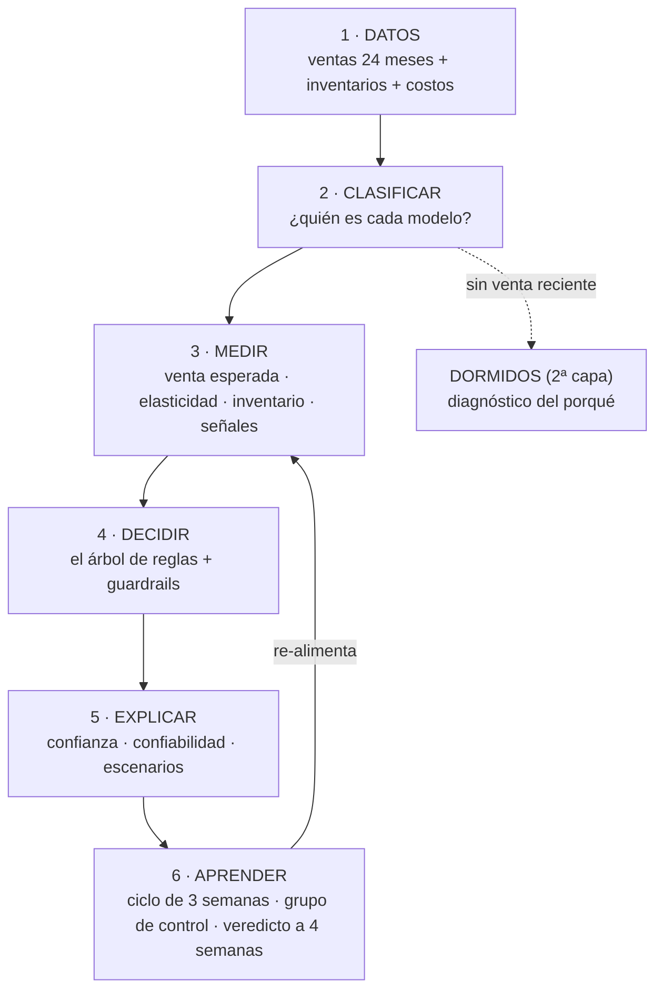

# ⚙️ Cómo funciona el Motor de Precio Óptimo v3 — paso a paso

> El motor revisa **todo el catálogo cada 3 semanas** y responde una sola
> pregunta por modelo: *¿el precio de lista debe subir, bajar o quedarse —
> y con cuánta seguridad lo sabemos?* Nunca escribe precios: recomienda,
> explica y mide. Los cambios se aplican solo por el flujo del ERP.

---

## Etapa 1 — Los datos (la materia prima)

Cada ciclo se trae de la base de datos (solo lectura):

- **Ventas línea por línea de 24 meses** (~9 millones de renglones limpios): qué se vendió, a qué precio de lista, a qué precio neto realmente cobrado, con qué costo y a cuántos clientes.
- **Inventario semanal**: stock vendible (en almacenes de venta, sin apartados), reposición en camino y los **dos costos** (el del stock en mano y el de reposición del proveedor).
- **Limpieza antes de opinar**: fuera los kits (no tienen precio propio), los servicios, los precios simbólicos de promociones, las semanas incompletas; y la **venta de proyecto se separa** — cuenta como ingreso, pero no como demanda (un pedido negociado no dice nada del precio de lista).

## Etapa 2 — Clasificar: ¿quién es cada modelo?

Antes de medir nada, el motor le pone apellidos a cada modelo:

| Clasificación | Pregunta que responde | Para qué sirve |
|---|---|---|
| **¿Vivo o dormido?** | ¿Tiene venta reciente suficiente para opinar? | 12,594 van al **motor principal**; los ~5,700 sin venta reciente van a la **2ª capa (dormidos)** con otro tratamiento |
| **Tipo de venta** | ¿Vende parejo, errático, esporádico o irregular? | Define **qué método pronostica** su venta y pone tope a la confianza (una venta irregular nunca puede declararse "confianza alta") |
| **Rol de precio** | ¿Es un producto que forma la **imagen de precio** (KVI), uno que **jala ventas**, uno que **deja margen**, o estándar? | Los KVI tienen política especial: no suben sin demanda confirmada a 12–24 meses |
| **Territorio** | ¿Su demanda es **ancha** (crece en muchas sucursales) o **concentrada** (una sucursal domina)? | Contexto en cada recomendación: concentrada huele a cliente/proyecto local, no a mercado |

## Etapa 3 — Medir: los cuatro números de cada modelo

1. **Venta esperada** — cuánto vendería si no tocamos el precio. La pronostica el método que **ganó el duelo** para su tipo de venta (un modelo de aprendizaje automático para las ventas estables; un método especializado en ventas esporádicas para la cola difícil). Regla de la casa: *si un método no le gana a un promedio simple en datos que no vio, no entra*. Cada pronóstico trae su **margen de error** medido contra la realidad.
2. **Elasticidad** — qué tanto cae la venta si el precio sube 1%. Se estima con la historia de precios y ventas del propio catálogo, por segmento de rotación y **afinada por proveedor**; se contrasta con un segundo estimador independiente. Sabemos (y está documentado) que tiende a exagerar — por eso el motor es prudente con las subidas y el experimento del grupo de control dará el número definitivo.
3. **Meses de inventario** — stock vendible ÷ venta recurrente de los últimos 6 meses (ajustado si el producto es nuevo).
4. **Señales propias** — la historia reciente del modelo: ¿su demanda crece mes contra mes? ¿la venta cayó después de un aumento (sin que el costo lo justificara)? ¿está caro y perdiendo participación? ¿el stock se está acabando más rápido de lo que llega?

## Etapa 4 — Decidir: el árbol de reglas (en este orden)

1. **¿Conviene mover el precio?** La elasticidad y el margen dicen la dirección tentativa (paso máximo ±4%).
2. **Revertir aumento dañino** — si tras una subida la venta cayó contra el mercado y el costo no la justifica: bajar de regreso.
3. **El sobrestock manda** — ≥12 meses de inventario: nunca subir; con margen, bajar para rotar el capital.
4. **Vendiendo caro** — margen de los más altos y perdiendo venta/participación: bajar para recuperar.
5. **Frenar** — demanda creciendo y stock cayéndose durante el reabasto: subir para no regalar el inventario escaso (con **seguimiento diario**: al reabastecer se re-decide).
6. **Política KVI** — un producto de imagen de precio no sube, salvo freno o demanda confirmada también a horizonte largo (12–24 meses).
7. **Piso de margen** — ninguna bajada deja el margen debajo de costo +3 puntos. Y ningún precio baja del mínimo autorizado que el negocio defina.
8. **Sin evidencia suficiente ⇒ sin opinión** — preferimos no opinar a opinar mal. Es una decisión de diseño, no una falla.

**Guardrails transversales**: paso máximo ±4% por ciclo de 3 semanas, un precio nunca se mueve dos semanas seguidas, el precio es nacional. Dos excepciones acordadas: la re-decisión de un freno al reabastecer, y la **defensa de margen por costo** (si el costo del proveedor sube y rompe el piso, se alerta el mismo día — solo para restaurar el piso, no para re-optimizar).

## Etapa 5 — Explicar: cada recomendación se defiende sola

- **Confianza** (alta/media/baja): cuánta historia, cuántos clientes, qué tan pronosticable es su venta. Baja = sin opinión.
- **Confiabilidad**: qué pasó en los **cambios reales similares del pasado** (miles de eventos, limpiados de espejismos estadísticos): "en 2,151 cambios similares, +4.2% de utilidad; ganó la mitad de las veces".
- **Escenarios**: el sugerido y sus vecinos, cada uno con su venta proyectada, su margen de error y su sello — **SEGURA ✓** (gana en todo el rango con 95% de confianza), **DUDOSA** o **PIERDE**.
- **La explicación en palabras**: por qué esta recomendación, qué la respalda, y las menciones que dan contexto (demanda ancha o concentrada, venta irregular, grupo de control).

## Etapa 2ª capa — Los dormidos: diagnóstico del porqué

Los modelos sin venta reciente no se ignoran: se les hace autopsia. Primero los descartes (¿vende por carrete /KM? ¿su pausa coincidió con falta de stock? — esos no son dormidos de verdad), y luego el diagnóstico:

| Qué pasó con el precio | Diagnóstico | Acción |
|---|---|---|
| Subió y la venta murió | **Quedó caro** | **Reactivar**: volver a su último precio con ventas (directo, sin gradualidad) — con la regla de los dos costos y el detector de "incrementos de laboratorio" 🧪 (subimos porque el costo subió… pero nunca compramos a ese costo) |
| Bajó y no reaccionó | Obsolescencia probable | **Liquidar** para recuperar capital |
| No se movió y murió igual | La causa no fue el precio | **Evaluar continuidad** (decisión de catálogo, no de precio) |

Solo se muestran los accionables: >8 semanas sin venta **y** con stock vendible, ordenados por capital atrapado.

## Etapa 6 — Aprender: el ciclo que se corrige solo

1. **Se emite el ciclo**: las recomendaciones quedan congeladas (nadie puede retocarlas después de ver el resultado).
2. **Grupo de control 🎲**: un 15% aleatorio de los elegibles NO se aplica este ciclo — es la única forma honesta de medir el efecto real de los cambios (y de obtener nuestra propia elasticidad experimental).
3. **Se aplica** (vía ERP) y cada cambio aceptado entra al **monitoreo**: su venta real se registra cada 7 días, y a las 4 semanas recibe **veredicto** — éxito, neutro o fracaso contra el contrafactual de no haber movido.
4. **Diagnóstico del motor**: índice de éxito por dirección, magnitud y tipo de venta; rango de error de las proyecciones; ¿el motor rinde en vivo lo que prometía?
5. **Vigilancia diaria automática**: frenos esperando reposición, costos que rompen el piso de margen.
6. **Tablero de campeones**: ningún modelo interno tiene el puesto seguro — cada método de pronóstico, banda y estimador re-compite en cada corrida con juez y cadencia fijados de antemano. Se cambia por victoria medida, nunca por moda.

---

### La foto de la corrida vigente (datos al 2026-07-13)

**12,594 modelos evaluados** → 7,041 subir · 3,336 bajar · 2,217 conservar (1,489 sin opinión) · **ganancia adicional estimada: +$121,654/semana** (confianza alta+media) · grupo de control: 1,304 modelos · **1,495 dormidos accionables** con $6.3M de capital atrapado · primer cierre de ciclo: 2026-08-03.

*Documento derivado del código real (docs/ARQUITECTURA_V3.md es la referencia técnica completa). Motor de Precio Óptimo v3 · 2026-07-27.*
